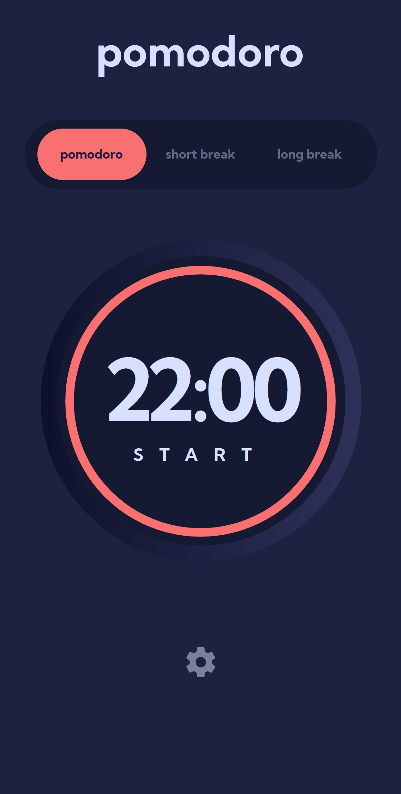
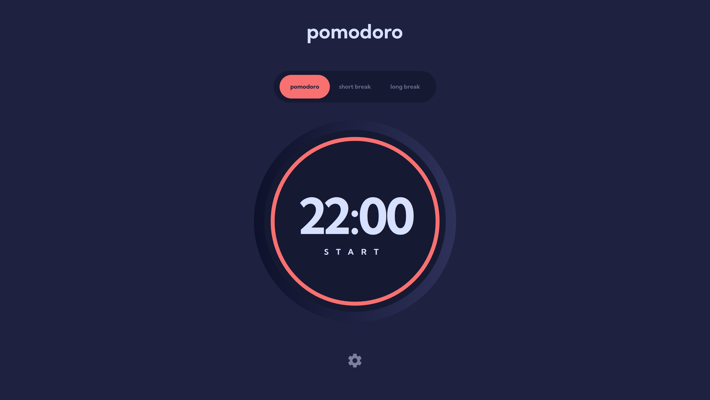
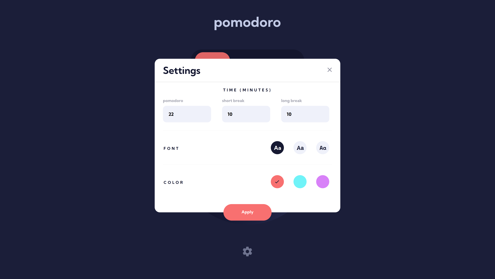

# Frontend Mentor - Pomodoro app solution

This is a solution to the [Pomodoro app challenge on Frontend Mentor](https://www.frontendmentor.io/challenges/pomodoro-app-KBFnycJ6G). Frontend Mentor challenges help you improve your coding skills by building realistic projects.

## Table of contents

- [Overview](#overview)
  - [The challenge](#the-challenge)
  - [Screenshot](#screenshot)
  - [Links](#links)
- [My process](#my-process)
  - [Built with](#built-with)
  - [What I learned](#what-i-learned)
  - [Continued development](#continued-development)
  - [AI Collaboration](#ai-collaboration)
- [Author](#author)

## Overview

### The challenge

Users should be able to:

- Set a pomodoro timer and short & long break timers
- Customize how long each timer runs for
- See a circular progress bar that updates every minute and represents how far through their timer they are
- Customize the appearance of the app with the ability to set preferences for colors and fonts

### Screenshot

#### Mobile

#### Desktop

#### Settings

### Links

- Solution URL: [https://github.com/jkaps9/pomodoro-app](https://github.com/jkaps9/pomodoro-app)
- Live Site URL: [https://jkaps9.github.io/pomodoro-app/](https://jkaps9.github.io/pomodoro-app/)

## My process

### Built with

- Semantic HTML5 markup
- CSS custom properties
- Flexbox
- CSS Grid
- Mobile-first workflow
- [React](https://reactjs.org/) - JS library

### What I learned

I have learned much more about react. In particular I have learned about "lifting state" which means to keep a single source of truth in a parent component. The parent component can then pass the values of state down to children as props to update their appearance. This allows for passing data around the application.

I also learned about the native HTML dialog element which was an excellent choice for the settings modal. It reduced the need to have state for visibility of the modal, and made it easier to open and close the modal.

### Continued development

I need to focus on making my own tests for react components. Currently relying a bit on AI for writing those tests.

### AI Collaboration

I am currently relying on AI for writing my testing suite. I am manually checking the code and ensuring I understand it.

## Author

- Frontend Mentor - [@jkaps9](https://www.frontendmentor.io/profile/jkaps9)
